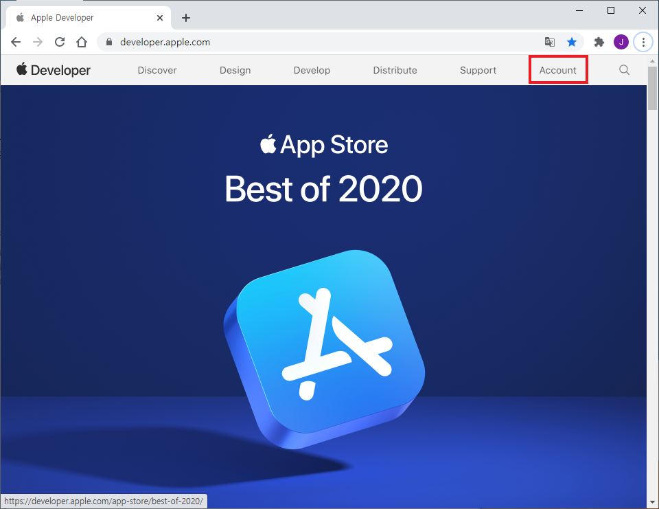

# JoinAppleDeveloperEnterpriseProgram
Guide to joining the Apple Developer Enterprise Program

---
## 엔터프라이즈 프로그램(Enterprise Program) 가입 신청

### 1. 애플 디벨로퍼 사이트에 접속합니다.
https://developer.apple.com/

### 2. Support 클릭

### 3. Articles 클릭

### 4. Choosing a Membership 클릭

### 5. 스크롤을 내리다 보면 Apple Developer Program 이 보입니다. 그곳에서 'Learn about enollment'을 클릭합니다.

### 6. 엔터프라이즈(Enterprise) 계정을 신청하는데 필요한 사항에 대해서 나옵니다. 밑에 'Start Yout Enollemnt' 버튼을 클릭 합니다.

### 7. 지금 만드세요 클릭

### 8. 필요한 정보를 입력하면서 최종 제출까지 진행

### 9. 마지막까지 신청 했으면 "애플 직원이 확인 후 연락이 갈 것이며 다음 진행사항을 진행한다"라는 문구가 보일 것입니다. 그렇게 진행하면 1차적으로 신청이 완료 된 것입니다.

### 10. 애플(Apple)에서 엔터프라이즈 계정 신청 조건 만족한 것을 확인하면 전화로 안내사항을 안내한 후 결제할 수 있는 링크를 제공해 줍니다.

### 11. 애플(Apple) 안내에 따라 결제을 진행하면 엔터프라이즈 계정을 발급 받게 됩니다. 하지만 계정 발급 후 2주후부터 엔터프라이즈 계정을 사용할 수 있습니다.

---
## D-U-N-S Number
D-U-N-S Number(Data Universal Numbering System)는 Dun & Bradstreet 에서 개별기업에 부여하는 개별기업 인식코드입니다. 
엔터프라이즈 계정을 신청 시 D-U-N-S Number 가 필요합니다. 계정 신청 창에서 D-U-N-S Number 을 모를 시 메일로 전송 요청할 수 있으며만약 D-U-N-S 정보 등록에 대한 정보 업데이트가 안되었다면 Apple D-U-N-S 정보 업데이트 신청할 수 있습니다.

---
## 엔터프라이즈 계정 참고사항
https://developer.apple.com/programs/enterprise/

### Application
As the person applying to the Apple Developer Enterprise Program on behalf of your organization, you must have the legal authority to bind your organization to legal agreements. You must be the organization’s owner/founder, executive team member, senior project lead, or have legal authority granted to you by a senior employee. To start your application, sign in with your Apple ID with two-factor authentication turned on. If you’re already enrolled in the Apple Developer Program for distributing apps on the App Store, or have an iTunes Connect account for distributing another media type (music, TV, movies, or books), you will need to use a different Apple ID.

### Verification
Verification is conducted to authenticate your organization's information, to validate your intended use of the program, and to ensure that the App Store, Apple Business Manager, Ad Hoc distribution, or TestFlight would not adequately meet your needs. Your organization must have a D-U-N-S Number, which is a unique nine-digit number assigned by Dun & Bradstreet and widely used as a standard business identifier. You can check to see if your organization already has a D-U-N-S Number and request one if necessary. They are free in most jurisdictions. Your organization must also have a publicly available website with a domain name that's associated with your organization. In addition, we may contact your organization to verify other details and continue to evaluate your use of the program. If you choose to renew your membership, your organization will be verified again. Apple reserves the right to reject your application at its sole discretion.

### Agreement and Payment
If your organization is approved for membership in the Apple Developer Enterprise Program, you will receive the enterprise program license agreement for review and acceptance. The Apple Developer Enterprise Program is 299 USD per membership year or in local currency where available.

---
## 엔터프라이즈 계정에 개발자 초대 방법

### 1. 애플 디벨로퍼 사이트에 접속합니다.
https://developer.apple.com/

### 2. Support 클릭

### 3. Apple Developer Enterprise 계정 로그인

### 4. People 클릭

### 5. Manage Users 클릭

### 6. [ + ] 아이콘 클릭

### 7. 아래와 같이 내용을 입력 후 '초대' 버튼 클릭

